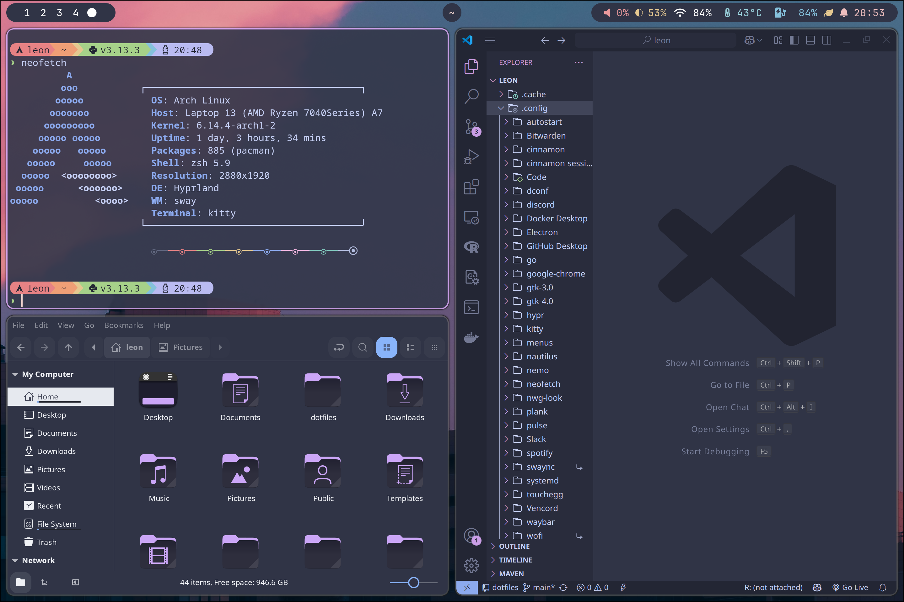

# Leon's Dotfiles

Welcome to my dotfiles! This repo contains the configuration files I use to set up and customize my Linux environment, primarily based on **Hyprland** and **Waybar**.

---

## 🖥️ Desktop Preview

> Featuring Waybar, Hyprland, and a custom Catppuccin-inspired color scheme.

---

## 🔧 Features

- **Window Manager**: [Hyprland](https://github.com/hyprwm/Hyprland)
- **Status Bar**: [Waybar](https://github.com/Alexays/Waybar) with:
  - Workspaces, window title
  - Pulseaudio volume
  - Brightness
  - Network
  - Temperature
  - Battery
  - Power profile
  - Notifications
  - Clock
- **Notification Center**: [Swaync](https://github.com/ErikReider/SwayNotificationCenter)
- **Launcher**: `wofi`
- **Theme**: Catppuccin Frappe

---
